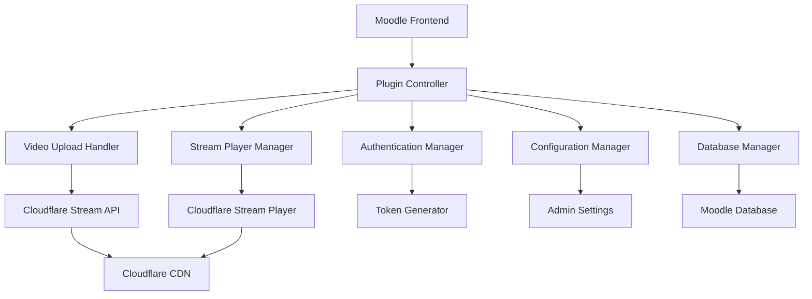

# Design Document - Moodle Cloudflare Stream Plugin

## Overview

Il plugin Moodle-Cloudflare Stream è un plugin di tipo "local" per Moodle che estende le funzionalità di gestione dei media integrando Cloudflare Stream come provider CDN per i video-corsi. Il plugin intercetta i caricamenti video, li trasferisce automaticamente su Cloudflare Stream e sostituisce i player video standard con il player di Cloudflare Stream, garantendo accesso autenticato e performance ottimali.

## Architecture

### High-Level Architecture



### Plugin Structure

Il plugin seguirà la struttura standard di Moodle per plugin di tipo "local":

```
/local/cloudflarestream/
├── version.php                 # Plugin metadata
├── settings.php               # Admin settings page
├── lang/
│   └── en/
│       └── local_cloudflarestream.php
├── classes/
│   ├── api/
│   │   ├── cloudflare_client.php
│   │   └── stream_manager.php
│   ├── handlers/
│   │   ├── upload_handler.php
│   │   └── player_handler.php
│   ├── auth/
│   │   └── token_manager.php
│   ├── privacy/
│   │   └── provider.php
│   └── task/
│       ├── sync_videos.php
│       └── cleanup_files.php
├── db/
│   ├── install.xml
│   ├── upgrade.php
│   └── tasks.php
├── templates/
│   ├── player.mustache
│   └── admin_dashboard.mustache
└── amd/
    └── src/
        ├── player.js
        └── admin.js
```

## Components and Interfaces

### 1. Cloudflare API Client

**Responsabilità:** Gestione delle comunicazioni con l'API di Cloudflare Stream

**Interfacce principali:**
- `upload_video($file_path, $metadata)` - Carica video su Cloudflare Stream
- `get_video_status($video_id)` - Ottiene lo stato di processing del video
- `delete_video($video_id)` - Elimina video da Cloudflare Stream
- `generate_signed_url($video_id, $expiry)` - Genera URL firmato per accesso temporaneo

**Configurazione richiesta:**
- API Token (con permessi Stream:Edit)
- Account ID
- Zone ID (opzionale per domini personalizzati)

### 2. Upload Handler

**Responsabilità:** Intercettazione e gestione dei caricamenti video

**Funzionalità:**
- Hook sui file upload di Moodle
- Validazione formato video (MP4, MOV, AVI, etc.)
- Upload asincrono su Cloudflare Stream
- Gestione stati di processing
- Fallback su storage locale in caso di errori

**Stati video:**
- `pending` - In attesa di upload
- `uploading` - Upload in corso
- `processing` - Processing su Cloudflare
- `ready` - Pronto per streaming
- `error` - Errore durante il processo

### 3. Stream Player Manager

**Responsabilità:** Sostituzione dei player video standard con Cloudflare Stream Player

**Funzionalità:**
- Rilevamento automatico dei video Cloudflare Stream
- Generazione embed code con autenticazione
- Configurazione player (controlli, autoplay, etc.)
- Gestione responsive design

### 4. Authentication & Token Manager

**Responsabilità:** Gestione dell'autenticazione e generazione token di accesso

**Funzionalità:**
- Validazione sessione utente Moodle
- Generazione JWT token per Cloudflare Stream
- Gestione scadenza token (default: 1 ora)
- Controllo permessi basato su ruoli e gruppi

**Token Structure:**
```json
{
  "sub": "user_id",
  "aud": "cloudflare_stream",
  "exp": "expiry_timestamp",
  "iat": "issued_at",
  "video_id": "cloudflare_video_id",
  "course_id": "moodle_course_id"
}
```

### 5. Configuration Manager

**Responsabilità:** Gestione configurazioni plugin

**Impostazioni configurabili:**
- Credenziali Cloudflare (API Token, Account ID)
- Impostazioni upload (formati supportati, dimensione max)
- Impostazioni player (controlli, watermark)
- Impostazioni sicurezza (durata token, domini autorizzati)
- Impostazioni pulizia (periodo grazia file locali)

## Data Models

### Database Tables

#### `local_cloudflarestream_videos`
```sql
CREATE TABLE local_cloudflarestream_videos (
    id BIGINT PRIMARY KEY AUTO_INCREMENT,
    moodle_file_id BIGINT NOT NULL,
    cloudflare_video_id VARCHAR(255) NOT NULL,
    course_id BIGINT NOT NULL,
    user_id BIGINT NOT NULL,
    status VARCHAR(50) NOT NULL DEFAULT 'pending',
    upload_date BIGINT NOT NULL,
    processing_date BIGINT NULL,
    ready_date BIGINT NULL,
    file_size BIGINT NOT NULL,
    duration INT NULL,
    thumbnail_url TEXT NULL,
    error_message TEXT NULL,
    metadata TEXT NULL,
    UNIQUE KEY uk_moodle_file (moodle_file_id),
    UNIQUE KEY uk_cloudflare_video (cloudflare_video_id),
    INDEX idx_course (course_id),
    INDEX idx_status (status)
);
```

#### `local_cloudflarestream_tokens`
```sql
CREATE TABLE local_cloudflarestream_tokens (
    id BIGINT PRIMARY KEY AUTO_INCREMENT,
    user_id BIGINT NOT NULL,
    video_id BIGINT NOT NULL,
    token_hash VARCHAR(255) NOT NULL,
    expires_at BIGINT NOT NULL,
    created_at BIGINT NOT NULL,
    last_used BIGINT NULL,
    ip_address VARCHAR(45) NULL,
    INDEX idx_user_video (user_id, video_id),
    INDEX idx_expires (expires_at),
    INDEX idx_token (token_hash)
);
```

### Configuration Schema

```php
// Plugin settings stored in Moodle config
$settings = [
    'api_token' => '', // Encrypted storage
    'account_id' => '',
    'zone_id' => '', // Optional
    'max_file_size' => 500 * 1024 * 1024, // 500MB
    'supported_formats' => ['mp4', 'mov', 'avi', 'mkv'],
    'token_expiry' => 3600, // 1 hour
    'cleanup_delay' => 7 * 24 * 3600, // 7 days
    'enable_watermark' => false,
    'player_controls' => true,
    'autoplay' => false
];
```

## Error Handling

### Error Categories

1. **Configuration Errors**
   - Credenziali Cloudflare non valide
   - Permessi API insufficienti
   - Configurazione mancante

2. **Upload Errors**
   - File troppo grande
   - Formato non supportato
   - Errori di rete
   - Quota Cloudflare superata

3. **Streaming Errors**
   - Token scaduto o non valido
   - Video non trovato
   - Permessi insufficienti
   - Errori player

4. **Sync Errors**
   - Inconsistenze database
   - Video orfani
   - Stati non sincronizzati

### Error Handling Strategy

- **Graceful Degradation:** In caso di errori Cloudflare, fallback su player locale
- **Retry Logic:** Retry automatico per errori temporanei (3 tentativi con backoff esponenziale)
- **Logging:** Log dettagliato di tutti gli errori per debugging
- **User Feedback:** Messaggi di errore user-friendly per docenti e studenti
- **Admin Notifications:** Notifiche automatiche per errori critici

### Monitoring & Alerts

```php
// Health check endpoints
class HealthChecker {
    public function check_cloudflare_connection();
    public function check_video_sync_status();
    public function check_token_generation();
    public function get_error_statistics();
}
```

## Testing Strategy

### Unit Testing

- **API Client Tests:** Mock delle chiamate Cloudflare API
- **Token Manager Tests:** Validazione generazione e verifica token
- **Upload Handler Tests:** Simulazione upload e gestione errori
- **Configuration Tests:** Validazione impostazioni e crittografia

### Integration Testing

- **Cloudflare API Integration:** Test con account Cloudflare di sviluppo
- **Moodle Integration:** Test con istanza Moodle di test
- **Database Operations:** Test CRUD su tabelle plugin
- **File System Operations:** Test upload e cleanup file

### End-to-End Testing

- **Upload Workflow:** Test completo caricamento video
- **Streaming Workflow:** Test visualizzazione video autenticata
- **Admin Workflow:** Test configurazione e monitoraggio
- **Error Scenarios:** Test gestione errori e fallback

### Performance Testing

- **Upload Performance:** Test con file di diverse dimensioni
- **Concurrent Users:** Test carico con utenti simultanei
- **Token Generation:** Test performance generazione token
- **Database Queries:** Ottimizzazione query e indici

### Security Testing

- **Token Security:** Test validazione e scadenza token
- **Access Control:** Test controlli autorizzazione
- **Input Validation:** Test sanitizzazione input utente
- **Configuration Security:** Test protezione credenziali

## Security Considerations

### Authentication & Authorization

- Integrazione completa con sistema di autenticazione Moodle
- Controllo permessi basato su capabilities Moodle
- Validazione sessione per ogni richiesta di streaming
- Supporto per Single Sign-On (SSO) se configurato in Moodle

### Data Protection

- Crittografia credenziali Cloudflare nel database
- Hashing dei token di accesso
- Sanitizzazione di tutti gli input utente
- Compliance GDPR per dati utente

### Network Security

- Validazione domini per embed player
- Protezione CSRF per form di configurazione
- Rate limiting per API calls
- Validazione SSL/TLS per comunicazioni Cloudflare

## Deployment & Maintenance

### Installation Requirements

- Moodle 3.9+ (LTS versions)
- PHP 7.4+
- cURL extension abilitata
- OpenSSL per crittografia
- Spazio disco per buffer upload

### Configuration Steps

1. Installazione plugin via Moodle admin
2. Configurazione credenziali Cloudflare
3. Test connessione API
4. Configurazione impostazioni upload e player
5. Attivazione scheduled tasks per manutenzione

### Maintenance Tasks

- **Sync Videos:** Task giornaliero per sincronizzazione stati
- **Cleanup Files:** Task settimanale per pulizia file locali
- **Token Cleanup:** Task orario per pulizia token scaduti
- **Health Check:** Task ogni 15 minuti per monitoraggio sistema